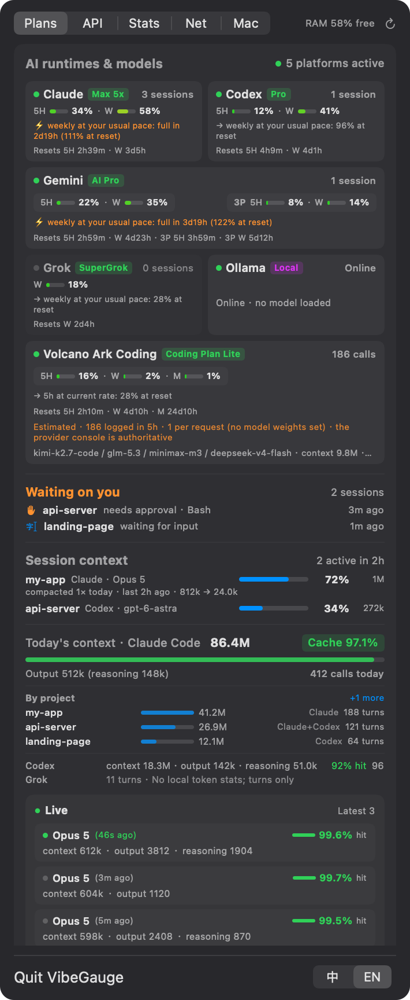
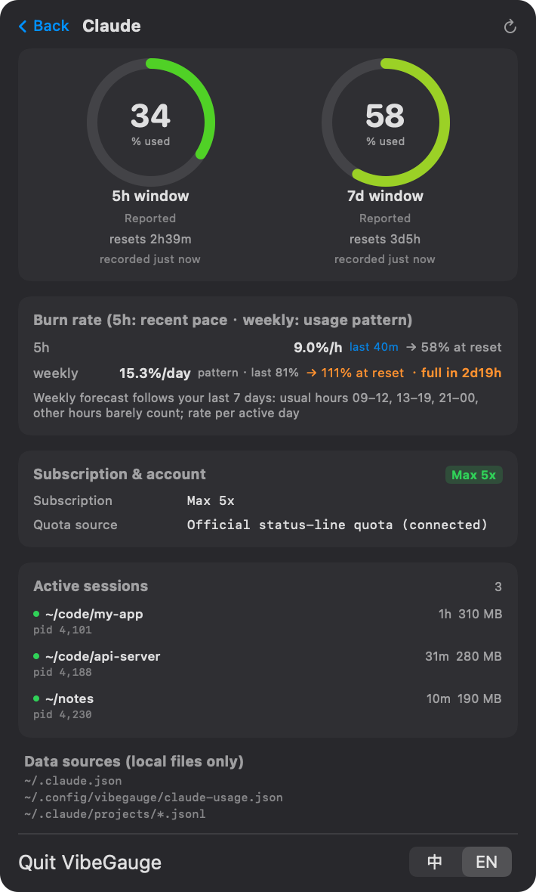
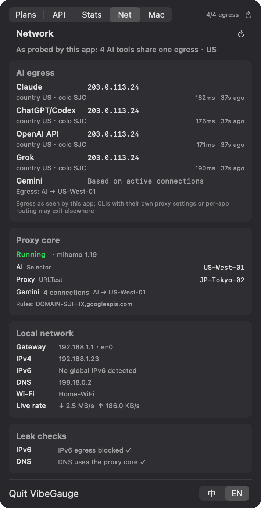
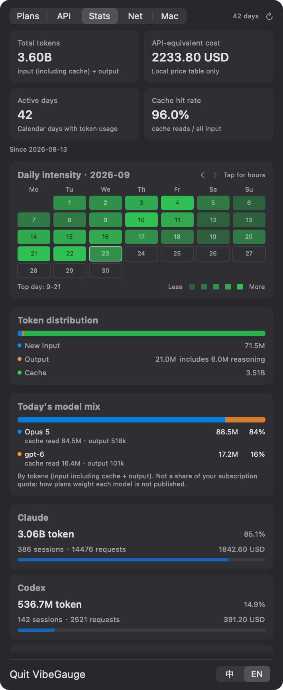
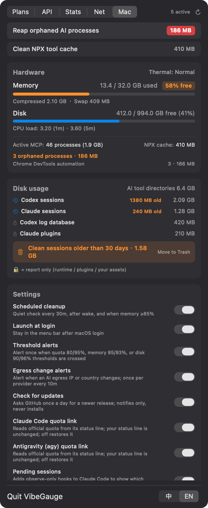

# VibeGauge 🧠

<p align="center">
  
</p>

<h3 align="center">The Native macOS Menu Bar Dashboard for Vibe Coders</h3>

<p align="center">
  <b>Claude / Codex / Gemini / Grok quotas with sleep-aware forecasts · AI egress IP & DNS-leak checks · Token & Prompt Cache analytics · Orphaned MCP reaper.</b>
</p>

<p align="center">
  <a href="https://github.com/MaxHaiCom/VibeGauge/releases"></a>
  
  
  
  
  <a href="./LICENSE"></a>
</p>

<p align="center">
  <b>🇺🇸 English</b> •
  <a href="README_zh.md">🇨🇳 简体中文</a>
</p>

---

<table>
  <tr>
    <td align="center" valign="top" width="33%"><br /><sub>Quotas at a glance</sub></td>
    <td align="center" valign="top" width="33%"><br /><sub>Sleep-aware weekly forecast</sub></td>
    <td align="center" valign="top" width="33%"><br /><sub>AI egress IP &amp; leak checks</sub></td>
  </tr>
  <tr>
    <td align="center" valign="top" width="33%"><br /><sub>42-day history &amp; cost</sub></td>
    <td align="center" valign="top" width="33%"><br /><sub>Orphan reaper, disk &amp; settings</sub></td>
    <td></td>
  </tr>
</table>

<p align="center"><sub>Screenshots use made-up demo data (<code>tools/screenshots.sh</code>).</sub></p>

---

## 💡 Why VibeGauge?

When using autonomous coding agents like **Claude Code**, **OpenAI Codex**, **Google Antigravity (agy)**, or **Grok CLI**, developers encounter three recurring frustrations:

1. **🧟‍♂️ Memory Leaks from Orphaned MCP Servers**:
   Every time an agent spins up or aborts, headless `node` or `python` Model Context Protocol (MCP) server processes are left behind (`PPID == 1`). Over days of coding, dozens or hundreds of these zombie processes quietly hoard **5 GB to 10 GB of RAM**, triggering heavy swap and system thermal throttling.
2. **⏳ Quota Blind Spots & "Reset Anxiety"**:
   Each vendor uses a different quota model — Claude's dynamic 5-hour rolling window and 7-day limits, Codex's weekly quotas, Gemini's credit pools. Wondering if your quota has reset or when you can code again usually requires hitting rate limits in the terminal or opening vendor dashboards.
3. **📊 Token Costs & Prompt Cache Black Hole**:
   How many tokens did you burn today? Is Prompt Caching actually hitting 95%+ to save your budget? How much thinking/reasoning token overhead was generated?

**VibeGauge** is built entirely with native **Swift + AppKit + SwiftUI**. It has **zero third-party dependencies and no prompt or usage-log uploads**. Usage analysis stays local; the Network tab makes only the trace requests documented below.

---

## ✨ Features

- 🧹 **One-Click Orphaned MCP Reaper**:
  - Automatically identifies headless MCP servers (`PPID == 1`, no listening ports, not on system whitelist, matches MCP signatures).
  - Multi-tier safety guards prevent accidental kills of legitimate dev tasks.
  - One-click clearing of `~/.npm/_npx` cache bloat.
  - Optional silent background sweep every 30 minutes.
- ⏱️ **Unified AI Quota & Reset Timers**:
  - **Claude**: Captures subscription tier (Max 5x / Max 20x / Pro / Team), 5-hour percentage, 7-day quota, and exact countdown to reset.
  - **Codex**: Detects primary `codex` bucket usage, identifies `usage_limit_exceeded` exact unlock timestamps, and supports optional passwordless SSH synchronization from remote dev machines.
  - **Gemini / Antigravity**: Tracks official and 3rd-party quota pools with respective reset dates.
  - **Grok**: Reads weekly credit usage and billing cycle reset boundaries.
  - **Sessions waiting on you** (optional, Claude Code hooks): which sessions wait for approval or input, and for how long; a notification after a minute. Observe-only: it records event types and times, never answers a prompt.
  - **Session context**: how full each active Claude / Codex session's context window is, and today's compactions.
  - **Local Model Probing**: Ollama, LM Studio (including headless llmster), llama.cpp (`llama-server`), and MLX (`mlx_lm.server`): online with which models loaded, online but idle, or process running but not answering. Read-only local requests; never triggers a model load.
  - **Forecast that knows you sleep**: Weekly quotas are projected from *your* last 7 days of usage — which hours you actually code (from local CLI logs) and how much you used last cycle — so a busy evening isn't extrapolated through the night. 5-hour windows use the recent pace.
- 📈 **Today's Token Analytics & Prompt Cache ROI**:
  - Aggregated daily stats: hundreds of millions in context tokens, output tokens, and thinking/reasoning tokens.
  - Real-time Prompt Cache hit rate calculations (e.g. 97.4% hit rate).
  - Live inspector capturing the latest 3 interaction rounds (model name, latency, cache hit %, tokens).
- 🔌 **Built-in Transparent API Key Proxy (Optional)**:
  - For direct API calls (e.g. routing Claude Code or scripts to GLM, DeepSeek, Kimi, MiniMax, OpenRouter).
  - Runs a local proxy daemon on `127.0.0.1:18790` with zero configuration needed.
  - Fetches plan tiers & remaining balances automatically while keeping keys strictly in memory.
- 🖥️ **macOS Native Craftsmanship**:
  - Pure Swift native app — starts instantly and sips minimal system resources.
  - Menu bar icon shows live available memory percentage.
  - Adaptive panel height with **two-finger trackpad swipe** to switch tabs smoothly.

---

## 🚀 Quick Start

### Method 1: Download Pre-built Binary (Recommended)

> Universal app — runs on **Apple Silicon and Intel** Macs with **macOS 14+**. UI in English / 简体中文 — follows your system, switch anytime at the panel's bottom-right.

1. Download the latest `VibeGauge.zip` from [GitHub Releases](https://github.com/MaxHaiCom/VibeGauge/releases).
2. Unzip and drag `VibeGauge.app` into your `/Applications` folder.
3. Launch it. The icon will appear in your top menu bar.
4. Using Claude Code or agy? Click **Connect quota** on its card once — the quota appears after your next message.

> **Tip**: On first launch, if prompted by macOS Gatekeeper, click "Open Anyway" in `System Settings → Privacy & Security`. If you use menu-bar management utilities like Bartender or Ice, make sure VibeGauge isn't hidden in a collapsed drawer.

---

### Method 2: Build from Source in 3 Seconds (Zero Dependencies)

No heavy Xcode installation required — only macOS standard command line tools (`swiftc`):

```bash
# 1. Clone the repository
git clone https://github.com/MaxHaiCom/VibeGauge.git
cd VibeGauge

# 2. Build and bundle
./build.sh

# 3. Launch
open VibeGauge.app
```

#### Headless & CLI Flags

```bash
# Offline deterministic tests: temp dirs + built-in log fixtures, no real logs, no network
./VibeGauge.app/Contents/MacOS/VibeGauge --selftest

# Local diagnostic snapshot for bug reports (IPs and command lines masked; no UI launched)
./VibeGauge.app/Contents/MacOS/VibeGauge --diagnose

# Install / Uninstall the background API accounting proxy daemon
./VibeGauge.app/Contents/MacOS/VibeGauge --install-proxy
./VibeGauge.app/Contents/MacOS/VibeGauge --uninstall-proxy
```

---

## 🔍 Data Sources & Freshness

All subscription tiers, quotas, and token metrics are read strictly from local session logs or vendor cache files:

| Provider | Plan Detection | Quotas & Reset Timestamps | Update Frequency |
|:---|:---|:---|:---|
| **Claude** | `~/.claude.json`<br>(e.g. `max_5x`, `max_20x`, `pro`) | Official 5h / 7d usage Claude Code hands to its status line<br>(**one click**: “Connect quota” on the card) | Every Claude Code status-line refresh |
| **Codex** | `~/.codex/auth.json`<br>(JWT `chatgpt_plan_type`) | Session jsonl `rate_limits`<br>(Extracts exact unlock time from `task_complete` errors) | Updates only when requests are actively sent |
| **Gemini** | Local auth token verification | Official quota agy hands to its status line, Gemini & 3rd-party pools<br>(**one click**: “Connect quota” on the card) | Every agy status-line refresh |
| **Grok** | `~/.grok/settings_cache.json` | `~/.grok/logs/unified.jsonl`<br>(Latest billing credits config & period end) | Periodically flushed by Grok CLI |
| **Kimi Code** | `~/.kimi-code` | Official local service `kimi web`: `GET /api/v1/oauth/usage`<br>(5h / weekly / monthly, extra-usage balance) | Only while `kimi web` is running |
| **Ollama / LM Studio / llama.cpp / MLX** | Process match + read-only local endpoints (`/api/ps`, `/api/v1/models`, `/v1/models`) | No cloud quota (online state and loaded models) | Cached 10 s |

> 🔗 **How “Connect quota” works**: Claude Code and agy pass the official quota to their status-line command on every refresh. Connecting swaps in VibeGauge's small bridge script (`~/.config/vibegauge/vibegauge-statusline.py`, stdlib Python), which saves a copy and then hands the exact same input to your previous status line — what you see doesn't change. Your `settings.json` is backed up first (`settings.json.vibegauge-backup`); turn it off under **Mac → Settings** to restore it. No credentials are read and no requests are made.

> 📌 *Note*: Footnotes such as "Recorded 1h ago" represent the **timestamp when the vendor CLI last refreshed its local log**, not a lag in VibeGauge. VibeGauge's incremental delta-scanner runs in ~100ms when the panel is open.

---

## Network and Historical Statistics

The panel has five tabs: **Subscriptions / API / Statistics / Network / System**.

- **Network** probes only each AI domain's `/cdn-cgi/trace` endpoint (Anthropic, ChatGPT, OpenAI API and Grok), once per minute with fresh connections. Gemini has no trace endpoint; its route is shown only when the local clash connection table contains an active connection. Failures remain visible as unavailable.
- The local clash API is read every 10 seconds (`clashAPI`, default `http://127.0.0.1:9090`; optional `clashSecret`). Only loopback addresses are accepted. Local interface, route and DNS information refresh every 30 seconds; byte counters are sampled at least two seconds apart. No network configuration is changed.
- Every 10 minutes, an IPv6-only request to Cloudflare's trace endpoint checks IPv6 reachability, and local resolver addresses are checked for possible DNS leakage. These are indicators, not proof that all traffic follows the same route. Exit-change notifications are enabled by default, with a 10-minute cooldown per AI.
- **Statistics** reads local Claude, Codex and API proxy logs in the background, then updates incrementally every five minutes. Claude requests are deduplicated across files; Codex uses per-request usage when available and cumulative differences otherwise. Events are grouped by their timestamps in the local timezone.
- History is stored in `~/.config/vibegauge/usage-daily.json`. Removing old logs retains their already-cached history; rewriting a file replaces its contribution. Session counts are distinct log files. CLI and API proxy sources can include the same call and are not deduplicated against each other.
- API-equivalent cost uses only `~/.config/vibegauge/prices.json`. Unpriced models are explicitly excluded; there are no built-in production prices. Token totals include cached input and output; reasoning tokens are part of output.

No prompts or usage logs are uploaded by these features. Network probes necessarily make the outbound requests described above. The optional existing API proxy and remote Codex synchronization retain their own behavior. `--selftest` runs only offline fixtures. `--diagnose` skips remote SSH and prints masked network and real historical summaries.

---

## 🛠️ API Key Accounting Proxy (Optional)

When routing terminal tools or scripts directly to AI provider endpoints, route requests through the local proxy to capture token analytics and credit balances:

1. **Install Proxy Daemon**:
   Click "Install API Proxy" in the API tab, or run:
   ```bash
   ./VibeGauge.app/Contents/MacOS/VibeGauge --install-proxy
   ```
   The proxy listens on `127.0.0.1:18790` (change it with `proxyPort`, see Configuration). It reaches upstreams through your macOS system proxy if one is set (or `HTTPS_PROXY`); to pin a route, write `{"upstream": "http://127.0.0.1:7890"}` or `{"upstream": "direct"}` to `~/.config/vibegauge/proxy.json`. Local models on `localhost` always go direct. Details: [docs/PROTOCOL.md](docs/PROTOCOL.md#reaching-the-upstream-proxyjson-stable).

2. **Zero-Config Routing**:
   Simply prefix your existing endpoint URL:
   ```bash
   # GLM (Zhipu AI)
   export ANTHROPIC_BASE_URL=http://127.0.0.1:18790/https://open.bigmodel.cn/api/anthropic
   
   # DeepSeek
   export OPENAI_BASE_URL=http://127.0.0.1:18790/https://api.deepseek.com/v1
   ```
   *(One-liner to prepend the proxy to all ANTHROPIC_BASE_URL declarations in `~/.zshrc`:)*
   ```bash
   perl -pi.bak -e 's#(ANTHROPIC_BASE_URL=["\x27]?)(?!http://127\.0\.0\.1:18790/)(https?://)#$1http://127.0.0.1:18790/$2#' ~/.zshrc
   ```

3. **Supported Providers**:
   - **GLM Coding Plan**: Automatic tier & 5h/weekly quota tracking
   - **OpenRouter**: Real-time remaining balance & credits calculation
   - **DeepSeek**: Balance endpoint integration
   - **Kimi / MiniMax / Volcano Ark / MiMo**: Streaming token usage accounting

---

## ⚙️ Configuration (Optional)

Everything works with zero config. These files and settings are only needed for the extras.

**Price table** — `~/.config/vibegauge/prices.json`. VibeGauge ships no built-in prices (they change too often; a wrong number is worse than none). Without it, "API-equivalent cost" is simply hidden.
```bash
mkdir -p ~/.config/vibegauge
curl -fsSL https://raw.githubusercontent.com/MaxHaiCom/VibeGauge/main/Resources/prices.example.json -o ~/.config/vibegauge/prices.json
# then fill in per-million-token prices; model names match by longest prefix
```

**Request-based plan limits** — `~/.config/vibegauge/plans.json` (see [`Resources/plans.example.json`](Resources/plans.example.json)). For coding plans that expose no usage API, quota = requests counted by the local proxy ÷ the limit you enter, always labelled *estimated*.

**Advanced settings** (`defaults write com.haifeng.vibegauge <key> <value>`, then restart the app):

| Key | Default | Purpose |
|-----|---------|---------|
| `logRetentionDays` | `30` | Session logs older than this are offered for cleanup (min 7) |
| `clashAPI` | `http://127.0.0.1:9090` | Clash / mihomo / sing-box controller for the Network tab (loopback only) |
| `clashSecret` | — | Controller secret, if you set one |
| `codexRemoteHost` | off | `user@host` with password-less SSH; merges Codex quota from another Mac |
| `proxyPort` | `18790` | Accounting proxy port, if 18790 is taken (1024–65535); reinstall the proxy from the menu afterwards |

All files, fields, and switches are specified in [docs/PROTOCOL.md](docs/PROTOCOL.md).

---

## 🗑️ Uninstall

```bash
/Applications/VibeGauge.app/Contents/MacOS/VibeGauge --uninstall-proxy   # only if you installed the proxy
python3 ~/.config/vibegauge/vibegauge-statusline.py --uninstall claude   # only if you connected quota (same for: agy)
rm -rf /Applications/VibeGauge.app ~/.config/vibegauge
defaults delete com.haifeng.vibegauge
```
If you enabled *Launch at Login*, turn it off in the menu first (or remove it in System Settings → General → Login Items). Remember to strip the `http://127.0.0.1:18790/` prefix (or your `proxyPort`) from any `*_BASE_URL` you pointed at the proxy.

---

## 🛡️ Privacy & Security

- 🔒 **100% Local Data**: No analytics, no telemetry, no remote servers. Your token counts and usage data never leave your Mac.
- 🔄 **Update check**: once a day VibeGauge asks the public GitHub API for the latest release version (no identifiers, nothing uploaded). It only shows a notice — it never downloads or installs anything. Turn it off under **Mac → Settings**.
- 🔑 **Zero Key Disk Logging**: API keys processed by the local proxy remain strictly in volatile process memory for upstream balance checks. Recorded logs only store an 8-character SHA-256 fingerprint; URL query parameters are stripped.
- ⚙️ **Non-Intrusive**: VibeGauge reads local logs and network settings, and makes the documented trace probes. To show your plan and sign-in state it reads a few fields from the CLIs' local auth files: the plan and subscription-date claims inside Codex's `auth.json` id_token (the plan shown on the card prefers the session logs), and the sign-in mode of agy / Grok. For Kimi Code it reads the local `kimi web` bearer token (`~/.kimi-code/server.token`) and sends it only to that service on `127.0.0.1`, after checking the port really is `kimi web`. **Tokens are never copied, stored, logged, or sent off the machine**, and VibeGauge never authenticates as you. It does not proxy your login sessions or modify system network configurations. The only vendor config it touches is the `statusLine` entry, and only when you click “Connect quota” (backed up, reversible).
- 🌐 **API proxy balance checks** (only if you install the proxy): the API keys your tools send through it stay in the proxy's memory and are used every 5 minutes to query that same provider's balance / quota endpoint (DeepSeek, OpenRouter, Kimi …).
- 🛡️ **Whitelisted Safe Reaping**: The process cleaner strictly enforces multi-criteria verification before terminating orphaned processes.

---

## 🤝 Contributing

Contributions, feature requests, and bug reports are warmly welcomed — see [CONTRIBUTING.md](CONTRIBUTING.md). Security issues: please report privately, see [SECURITY.md](SECURITY.md).
- Discover a new MCP process pattern? Please open a PR to update the signature filters.
- Vendor changed their log format or introduced a new quota tier? Feel free to submit an issue.

---

## 📄 License

Released under the [MIT License](LICENSE).
