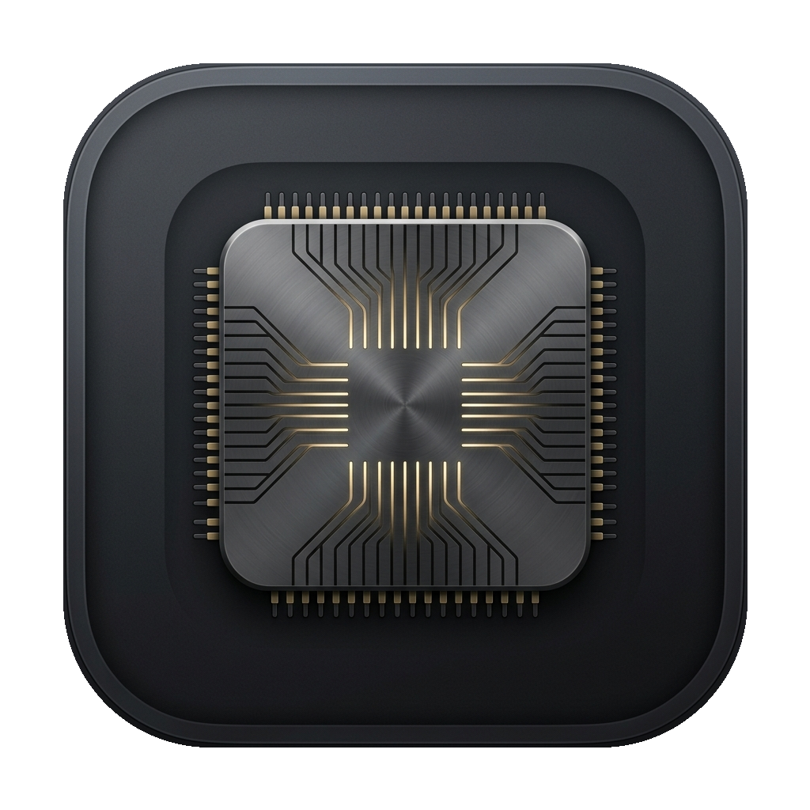
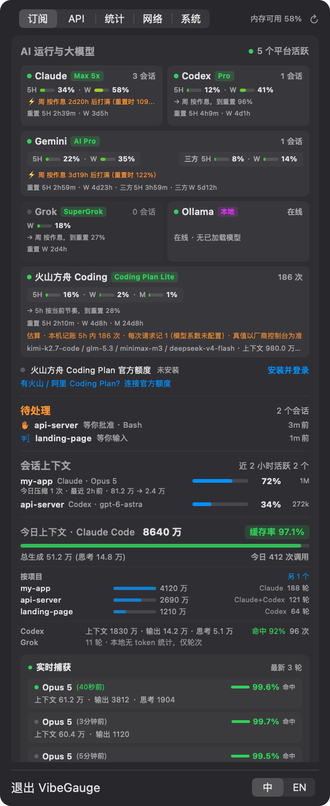
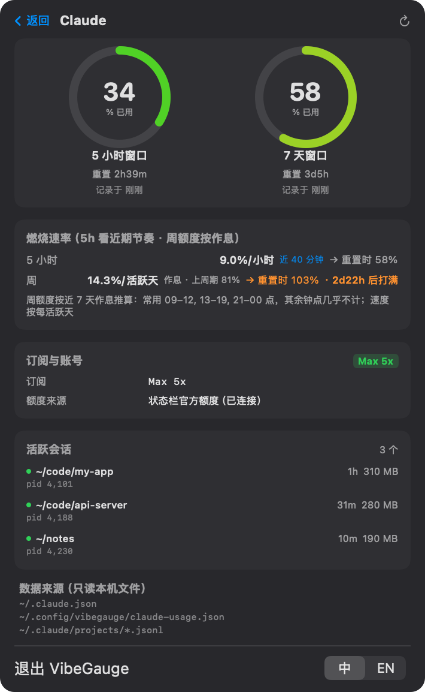
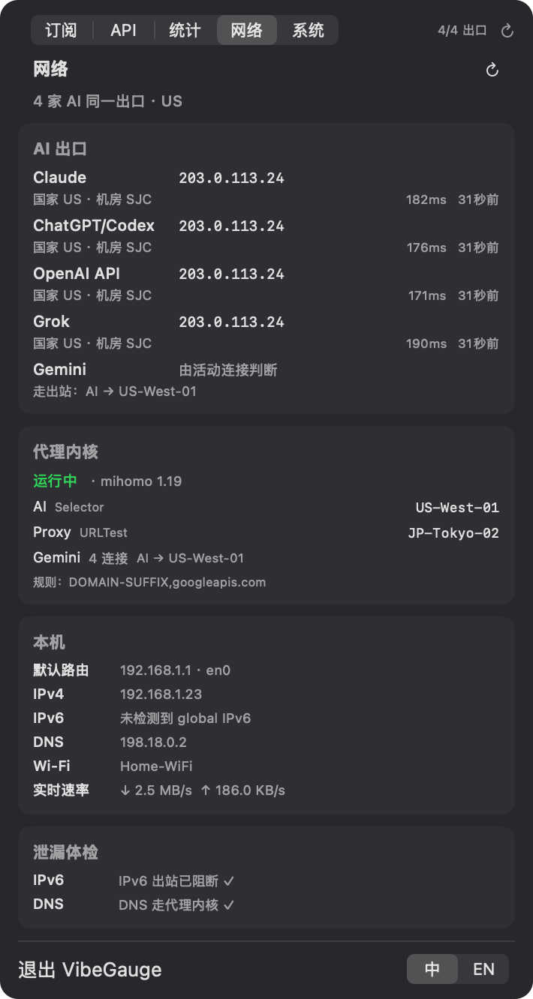
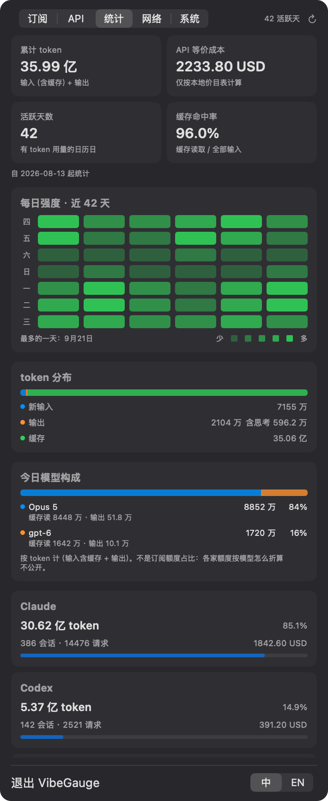
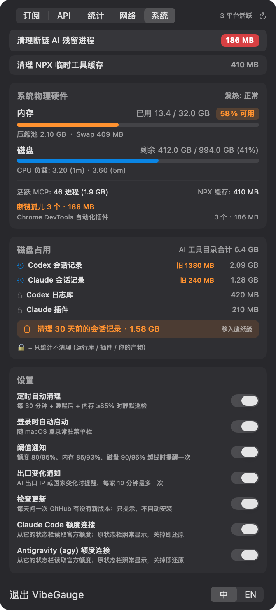

# VibeGauge 🧠

<p align="center">
  
</p>

<h3 align="center">专为 Vibe Coding 打造的 macOS 极简原生菜单栏仪表盘</h3>

<p align="center">
  <b>Claude / Codex / Gemini / Grok 额度与懂作息的用量预估 · AI 出口 IP 与 DNS 泄漏体检 · Token 与 Prompt Cache 统计 · 一键回收断链 MCP 进程</b>
</p>

<p align="center">
  <a href="https://github.com/MaxHaiCom/VibeGauge/releases"></a>
  
  
  
  
  <a href="./LICENSE"></a>
</p>

<p align="center">
  <a href="README.md">🇺🇸 English</a> •
  <b>🇨🇳 简体中文</b>
</p>

---

<table>
  <tr>
    <td align="center" valign="top" width="33%"><br /><sub>各家额度一览</sub></td>
    <td align="center" valign="top" width="33%"><br /><sub>懂作息的周额度预估</sub></td>
    <td align="center" valign="top" width="33%"><br /><sub>AI 出口 IP 与泄漏体检</sub></td>
  </tr>
  <tr>
    <td align="center" valign="top" width="33%"><br /><sub>近 42 天用量与成本</sub></td>
    <td align="center" valign="top" width="33%"><br /><sub>孤儿进程清理、磁盘与设置</sub></td>
    <td></td>
  </tr>
</table>

<p align="center"><sub>截图使用虚构的演示数据（<code>tools/screenshots.sh</code> 生成）。</sub></p>

---

## 💡 为什么需要 VibeGauge？

在深度使用 **Claude Code**、**OpenAI Codex**、**Google Antigravity (agy)**、**Grok CLI** 进行 AI 辅助编程（Vibe Coding）时，开发者普遍面临三类难以忍受的痛点：

1. **🧟‍♂️ MCP 僵尸进程吞噬内存**：
   频繁调起或重启各家 Agent 时，后台残留大量无头 `node` / `python` MCP 服务进程（`PPID == 1`）。往往几天下来，几百个孤儿进程悄悄吃掉 **5GB ~ 10GB 物理内存**，引发系统 Swap 暴涨、机器发热卡顿。
2. **⏳ 额度黑盒与「重置焦虑」**：
   各家的配额窗口各不相同——Claude 的 5 小时动态滚动窗口与 7 天上限、Codex 的周限额度、Gemini/Grok 的用量池……想要知道额度用完了没有、几点几分重置，只能在终端里反复碰壁，或者登录网页查看。
3. **📊 Token 成本与 Prompt Cache 盲区**：
   今天到底跑了几轮对话？上下文塞了多少亿 Token？Prompt Cache 命中率到底有没有达到 90%+ 帮你省钱？本地第三方国内模型（GLM、DeepSeek、Kimi、MiniMax）跑了多少用量？

**VibeGauge** 由纯 Swift + AppKit + SwiftUI 原生打造，**零第三方依赖、零网络外发、纯本地只读解析**，将整个 Vibe Coding 研发状态浓缩于 Mac 菜单栏中。

---

## ✨ 核心特性

- 🧹 **一键回收孤儿 MCP 进程**：内置严格的三层安全放行规则（仅回收父进程已死 `PPID=1`、无端口监听、不在系统白名单、具有 MCP 特征签名的 node/python 进程），绝不误杀开发环境；支持一键清空 `~/.npm/_npx` 缓存。
- ⏱️ **全平台额度与重置倒计时**：
  - **Claude**：实时截获当前订阅档位（Max 5x / Max 20x / Pro / Team）、5 小时窗口已用百分比、7 天上限以及精准至分秒的重置时刻。
  - **Codex**：解析主桶配额与打满状态，智能识别 `usage_limit_exceeded` 确切解封时刻；支持远程机器 SSH 免密拉取同步。
  - **Gemini / Antigravity**：实时跟踪官方池与三方池额度、重置周期。
  - **Grok**：实时读取周用量百分比与周期重置时间。
  - **本地运行探测**：Ollama、LM Studio（含独立版 llmster）、llama.cpp（`llama-server`）、MLX（`mlx_lm.server`）：区分「在线 · 已加载哪些模型」「在线但空载」「进程在跑但接口没应答」。只发本机只读请求，不会触发加载模型。
  - **懂你作息的额度预测**：周额度按**你自己近 7 天**的使用情况推算——几点在用（来自本地 CLI 日志）、上个周期用了多少——晚上猛用一阵不会被外推成通宵都在烧。5 小时窗口仍看近期节奏。
- 📈 **今日 Token 用量与缓存命中率大盘**：
  - 汇总今日总调用轮次、亿级上下文规模、输出 Token、思考（Thinking）Token。
  - 实时计算 Prompt Cache 命中率（精准展示 97%+ 缓存命中）。
  - 最近 3 轮交互动态回放（模型类型、耗时、思考消耗、缓存命中度）。
- 🔌 **内置无感 API Key 记账代理（可选）**：
  - 针对直接调用 API Key 的场景（如 Claude Code 接国内模型、脚本接入、Hermes 等），提供极轻量本地代理（监听 `127.0.0.1:18790`）。
  - 支持 **GLM Coding Plan**、**OpenRouter**、**DeepSeek**、**Kimi**、**MiniMax** 等国内外厂商的自动余额与套餐抓取。
  - **极致安全**：API Key 仅在内存临时处理，**绝不落盘、绝不外发**，日志仅记录截断指纹。
- 🖥️ **macOS 极简原生体验**：
  - 原生 Swift 编译，内存占用仅约十几 MB，极速启动。
  - 菜单栏图标动态嵌入系统当前内存可用百分比。
  - 面板高度根据内容自适应，支持**触控板双指左右轻扫无缝切换 Tab**。

---

## 🚀 快速使用

### 方式一：直接下载预编译 App（推荐）

> Universal 通用包：**Apple Silicon 与 Intel** Mac 均可运行，需 **macOS 14+**。界面支持简体中文 / English，默认跟随系统，面板右下角可随时切换。

1. 前往 [GitHub Releases](https://github.com/MaxHaiCom/VibeGauge/releases) 下载最新版 `VibeGauge.zip`。
2. 解压并将 `VibeGauge.app` 拖入 `/Applications`（应用程序）目录。
3. 双击打开，图标即会常驻在菜单栏右上角。
4. 用 Claude Code 或 agy 的话，在对应卡片上点一次 **「一键连接额度」**，下一条消息后额度就会出现。

> **提示**：首次打开如遇 macOS 安全提示，请在「系统设置」→「隐私与安全性」中点击「仍要打开」。若使用了 Bartender 等菜单栏收纳工具，请检查图标是否被收拢在隐藏区。

---

### 方式二：本地 3 秒编译构建（零依赖，无需完整 Xcode）

只需系统自带的 `swiftc`（安装 Command Line Tools 即可，无需打开或安装几十 GB 的 Xcode）：

```bash
# 1. 克隆代码仓库
git clone https://github.com/MaxHaiCom/VibeGauge.git
cd VibeGauge

# 2. 一键编译并打包
./build.sh

# 3. 启动应用
open VibeGauge.app
```

#### 命令行自测与无头模式

```bash
# 离线确定性测试：临时目录 + 内置日志样本，不读本机真实日志、不联网
./VibeGauge.app/Contents/MacOS/VibeGauge --selftest

# 本机诊断快照，报 Bug 时贴这个（IP 与命令行已脱敏，不启动 UI）
./VibeGauge.app/Contents/MacOS/VibeGauge --diagnose

# 启用/卸载 API 记账代理服务（基于 LaunchAgent）
./VibeGauge.app/Contents/MacOS/VibeGauge --install-proxy
./VibeGauge.app/Contents/MacOS/VibeGauge --uninstall-proxy
```

---

## 🔍 数据采集来源与更新机制

所有数据均来自于各家 CLI 本地产生的会话文件或官方接口缓存，**查不到即标明「无数据」，坚决不随意猜测**：

| 平台 | 订阅档位识别 | 额度与重置时间来源 | 数据更新时机 |
|:---|:---|:---|:---|
| **Claude** | `~/.claude.json`<br>（如 `max_5x` / `max_20x` / `pro`） | Claude Code 交给状态栏的官方 5h / 7d 额度<br>（卡片上点 **「一键连接额度」**） | Claude Code 每次刷新状态栏时 |
| **Codex** | `~/.codex/auth.json`<br>（JWT 包含的 `plan_type`） | 会话日志中的 `rate_limits`<br>打满时精准解析 `task_complete` 中的解封时间 | 仅在发出请求时写入；支持可选 SSH 远程多端同步 |
| **Gemini** | 检测本地鉴权标识与登录态 | agy 交给状态栏的官方额度，区分 Gemini 主池与三方池<br>（卡片上点 **「一键连接额度」**） | agy 每次刷新状态栏时 |
| **Grok** | `~/.grok/settings_cache.json` | `~/.grok/logs/unified.jsonl`<br>（解析 billing 信用百分比与周期截止时刻） | Grok 运行期间由后台定期刷回本地 |
| **Kimi Code** | `~/.kimi-code` | 官方本机服务 `kimi web` 的 `GET /api/v1/oauth/usage`<br>（5h / 周 / 月额度与加油包余额） | 仅在 `kimi web` 运行时可读 |
| **Ollama / LM Studio / llama.cpp / MLX** | 进程识别 + 本机只读接口（`/api/ps`、`/api/v1/models`、`/v1/models`） | 无云端额度约束（显示在线状态与已加载模型） | 10 秒缓存 |

> 🔗 **「一键连接额度」怎么工作**：Claude Code 和 agy 每次刷新状态栏，都会把官方额度交给状态栏命令。连接后，状态栏命令换成 VibeGauge 自带的小脚本（`~/.config/vibegauge/vibegauge-statusline.py`，纯 Python 标准库）：截下一份额度，再把同一份输入原样交给你原来的状态栏，显示不变。改动前自动备份 `settings.json`（`settings.json.vibegauge-backup`），在 **系统 → 设置** 里关掉即还原。不读任何凭据，不发任何请求。

> 📌 **注**：卡片脚注提示的「记录于 Nh前」是**上游 CLI 数据源本身的写入时间**，而非 VibeGauge 未刷新。面板打开时，内部引擎每秒增量扫描耗时仅 ~100ms。

---

## 🛠️ 国内模型 & API Key 记账代理（可选）

对于通过修改 `BASE_URL` 直接打各大模型 API 的场景，开启内置透明记账代理后，无需任何繁琐配置即可完成 Token 消耗与余额监控：

1. **安装启动代理**：
   在面板「API」标签页中点击「安装 API 记账代理」，或在终端运行：
   ```bash
   ./VibeGauge.app/Contents/MacOS/VibeGauge --install-proxy
   ```
   代理常驻监听在 `127.0.0.1:18790`（可用 `proxyPort` 改，见配置）。它访问上游时会自动走 macOS 系统代理（或 `HTTPS_PROXY`）；要固定线路，在 `~/.config/vibegauge/proxy.json` 写 `{"upstream": "http://127.0.0.1:7890"}` 或 `{"upstream": "direct"}`。本机 `localhost` 上的模型永远直连。细节见 [docs/PROTOCOL.md](docs/PROTOCOL.md#reaching-the-upstream-proxyjson-stable)。

2. **零配置路由注入**：
   只需在目标服务的 `BASE_URL` 前追加代理前缀即可，例如：
   ```bash
   # GLM 智谱
   export ANTHROPIC_BASE_URL=http://127.0.0.1:18790/https://open.bigmodel.cn/api/anthropic
   
   # DeepSeek 深度求索
   export OPENAI_BASE_URL=http://127.0.0.1:18790/https://api.deepseek.com/v1
   ```
   *(一行命令自动为 `~/.zshrc` 内所有 ANTHROPIC_BASE_URL 添加前缀，自动生成备份：)*
   ```bash
   perl -pi.bak -e 's#(ANTHROPIC_BASE_URL=["\x27]?)(?!http://127\.0\.0\.1:18790/)(https?://)#$1http://127.0.0.1:18790/$2#' ~/.zshrc
   ```

3. **支持的厂商额度与余额反查**：
   - **GLM Coding Plan**：支持 5H / 周配额与档位等级抓取
   - **OpenRouter**：余额与实时 Credits 消耗
   - **DeepSeek**：官方文档余额接口
   - **Kimi / MiniMax / 火山方舟 / 小米 MiMo** 等均支持 Token 流式记账

---

## ⚙️ 配置（可选）

零配置即可使用，下面这些只在需要扩展功能时才配。

**价目表** — `~/.config/vibegauge/prices.json`。VibeGauge 不内置价格（价格常变，编一个错的比不显示更糟）；不配就不显示「API 等价成本」。
```bash
mkdir -p ~/.config/vibegauge
curl -fsSL https://raw.githubusercontent.com/MaxHaiCom/VibeGauge/main/Resources/prices.example.json -o ~/.config/vibegauge/prices.json
# 然后填每百万 token 单价；模型名按最长前缀匹配
```

**按请求数计的套餐上限** — `~/.config/vibegauge/plans.json`（参考 [`Resources/plans.example.json`](Resources/plans.example.json)）。没有用量接口的 Coding Plan，额度 = 经本机代理的请求数 ÷ 你填的上限，面板一律标「估算」。

**高级设置**（`defaults write com.haifeng.vibegauge <键> <值>`，改完重启 App）：

| 键 | 默认 | 作用 |
|----|------|------|
| `logRetentionDays` | `30` | 超过这么多天的会话记录会列为可清理（下限 7） |
| `clashAPI` | `http://127.0.0.1:9090` | 网络 Tab 读取的 Clash / mihomo / sing-box 控制端口（只允许本机地址） |
| `clashSecret` | — | 控制端口密钥（如果设了） |
| `codexRemoteHost` | 关闭 | `user@host`，需免密 SSH；合并另一台 Mac 的 Codex 额度 |
| `proxyPort` | `18790` | 记账代理端口，18790 被占用时改（1024–65535），改完在菜单里重装代理 |

所有数据文件、字段和开关的完整说明见 [docs/PROTOCOL.md](docs/PROTOCOL.md)（英文）。

---

## 🗑️ 卸载

```bash
/Applications/VibeGauge.app/Contents/MacOS/VibeGauge --uninstall-proxy   # 装过记账代理才需要
python3 ~/.config/vibegauge/vibegauge-statusline.py --uninstall claude   # 连接过额度才需要（agy 同理）
rm -rf /Applications/VibeGauge.app ~/.config/vibegauge
defaults delete com.haifeng.vibegauge
```
若开启过「开机自启」，先在菜单里关掉（或到 系统设置 → 通用 → 登录项 移除）。别忘了把 `*_BASE_URL` 里的 `http://127.0.0.1:18790/` 前缀（改过端口就是你的端口）删掉。

---

## 🛡️ 安全与隐私边界

- 🔒 **数据 100% 留在本机**：不设置任何云端中转服务器，不上传任何用量数据、Token 记录与机器标识。
- 🔄 **检查更新**：每天向 GitHub 公开接口查询一次最新版本号（不带任何标识、不上传任何数据），只提示、从不自动下载安装。可在 **系统 → 设置** 关闭。
- 🔑 **API Key 零落盘**：记账代理截获的 API Key 仅暂存于内存中用于查询厂商余额，写入日志时强制抹除并仅保留 SHA-256 前 8 位脱敏指纹。
- ⚙️ **无入侵性**：只读扫描本地日志。为显示套餐与登录状态，会读取各 CLI 本地认证文件里的少数字段：Codex `auth.json` 里 id_token 的套餐与订阅起止日期声明（卡片上的套餐优先取会话日志），以及 agy / Grok 的登录方式。Kimi Code 会读取本机 `kimi web` 的访问 token（`~/.kimi-code/server.token`），先确认端口上确实是 `kimi web`，再只发给 `127.0.0.1` 上的这个服务。**token 从不复制、保存、记录或发出本机**，VibeGauge 也从不以你的身份登录任何服务；不代理 OAuth 登录流程。唯一会改的厂商配置是 `statusLine` 一项，且只在你点「一键连接额度」时改（先备份，可还原）。
- 🌐 **记账代理的余额查询**（仅在安装代理后）：经代理的 API Key 只存在代理内存里，每 5 分钟用它向同一家厂商查询余额 / 额度（DeepSeek、OpenRouter、Kimi 等）。
- 🛡️ **严格的放行防护**：孤儿进程清理具备多重放行过滤器，确保绝对不误触系统关键进程与正常运行中的开发任务。

---

## 🤝 贡献与反馈

欢迎提交 Issue 与 Pull Request，流程见 [CONTRIBUTING.md](CONTRIBUTING.md)；安全问题请私密报告，见 [SECURITY.md](SECURITY.md)。
- 如果你发现了新的 MCP 孤儿进程签名，欢迎补充至放行/识别规则中。
- 如果某家 CLI 升级了日志格式或下发了新的额度字段，欢迎提 Issue 协助适配。

---

## 📄 开源许可

本项目遵循 [MIT License](LICENSE)。
